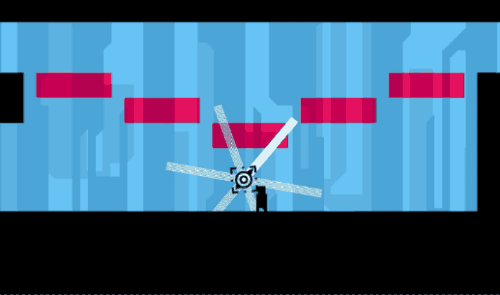

## 「雨の中」

Nintendo Switch向けに開発した2D横スクロールアクションゲーム
* 個人制作
* 開発環境：Visual Studio・C++・OpenGL
* 制作時間：約1ヶ月
* HAL三校合同コンテストで技術力賞受賞

## プレイ動画
https://github.com/user-attachments/assets/d3e88145-0230-4049-b4f1-ee3c7eba27d0

## ゲームの進め方
斬撃の赤い軌跡は、あるものを不可視にし、あるものを可視にする。  
空間と同化した攻撃や障害はすべて無視できる。  
Switchを回転させ、進むための角度を見つけよう！

## アピールポイント
### ゲームデザイン
* ジャイロセンサーを使う独特な操作方法とそれを楽しめるレベルデザイン
* シェーダー、パーティカルなどで作る特別な雰囲気

### 実装
* SwitchとWindowsの両プラットフォームに対応
    * コードを変更せずに実行できるよう、共通インターフェースを設計し、各プラットフォームの機能を抽象化しています。（著作権の都合上、該当コードは非公開としています。）
* 効率的な描画
    * インスタンス化により、多数のオブジェクトも性能を落とさず描画できます。
    * src/render/render_data.cppなど
* マップの動的読み込み
    * 広く連続したマップを実現し、拡張にも対応しやすいようにしています。
    * src/object/stage.cpp
* コンポーネントを使用したフレームワーク
    * 重複コードの削減し、他のプロジェクトでも再利用されています。

## 改善点

> 本作品は校内コンテスト向けに制作したもので、当時授業で扱った技術のみで開発し、
> テンプレート、コンテナなどの機能は使用していません。  
> また、短期間で初めてゲームフレームワークの構築したため、設計として不十分な部分もあります。
> 今後のプロジェクトで改善を進めています。

* 今後のプロジェクトでフレームワークを改良
* 演出と操作感のブラッシュアップ
* 内容をより充実させる

## 使用した素材

BGM: Kevin MacLeod
> Equatorial Complex, Lightless Dawn  
> Kevin MacLeod (incompetech.com)  
> Licensed under Creative Commons: By Attribution 4.0  
> https://creativecommons.org/licenses/by/4.0/  

効果音：魔王魂

キャラクター動画：hugues laborde
[https://hugues-laborde.itch.io/]  

ボタン素材：Kenny
[https://kenney.nl/]

KHドットフォント：Keitarou Hiraki, Font Silo  
> Licensed under SIL Open Font License 1.1